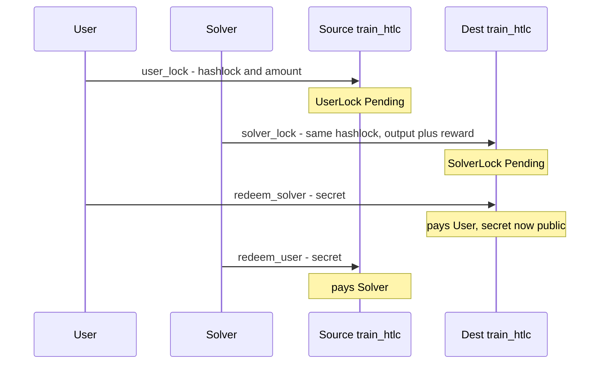
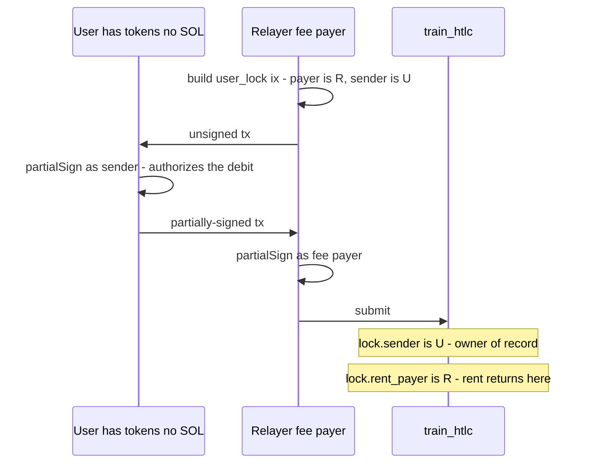
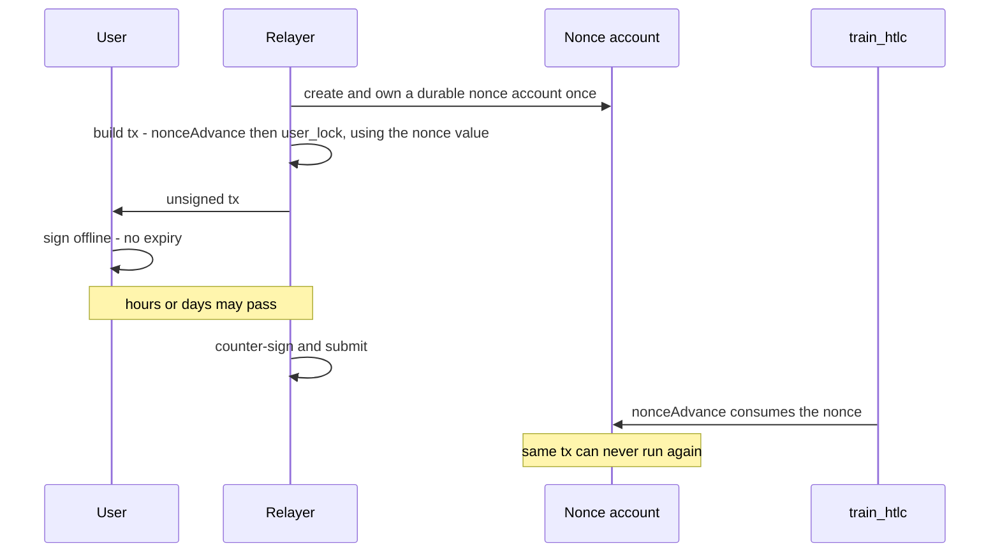
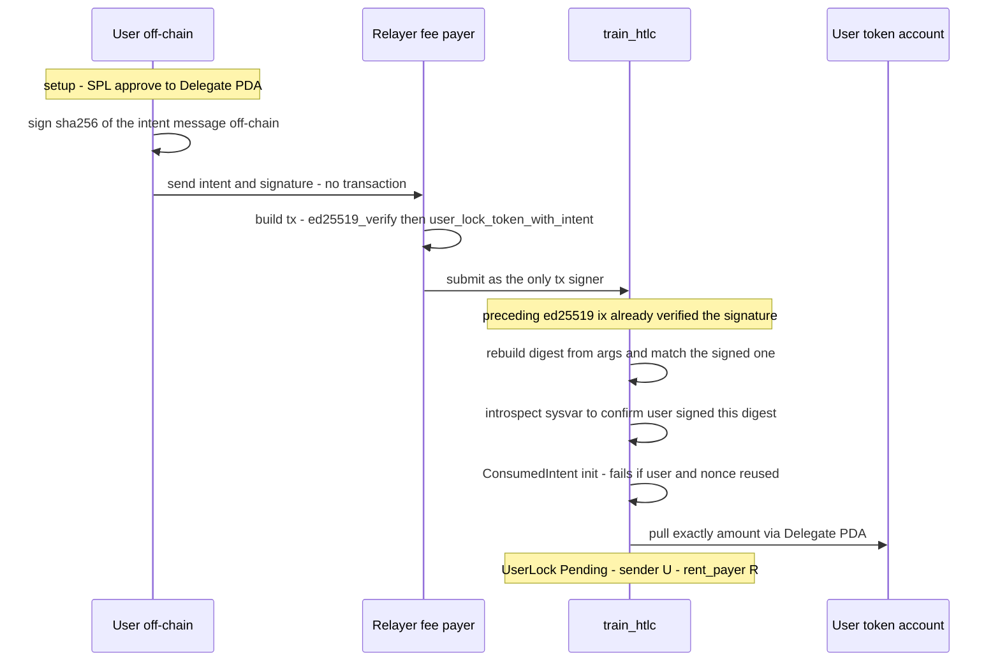

# Train HTLC (Solana) — Architecture

Hash time-locked escrow for cross-chain atomic swaps. Two parties — a **user**
(funds on the source chain) and a **solver** (funds on the destination chain) —
lock funds under the same `hashlock = sha256(secret)`. Revealing the secret unlocks
the counterparty's funds; timelocks let either side refund if the swap stalls.

The program custodies native SOL and SPL / Token-2022 tokens, supports optional
per-lock **payout curves**, and offers three **gasless** deposit paths so a user can
swap without holding SOL for fees.

Verification: the local suite is in `tests/` (run with `anchor test`); a full devnet
end-to-end run of every happy and unhappy path — with production actor separation and
explorer-verifiable transactions — is in [`e2e-devnet-report.md`](e2e-devnet-report.md)
(generated by `scripts/devnet-e2e.ts`). Actor roles are documented in the README.

---

## 1. Module layout

Each concern lives in one file; `lib.rs` holds only thin dispatch wrappers.

```
programs/train-htlc/src/
  lib.rs           # #[program] entrypoints — one-line forwarders to handlers
  state.rs         # account structs, status constants, instruction-param structs
  errors.rs        # TrainError
  events.rs        # emitted events
  utils.rs         # hashlock, measured transfers, vault close, curve CPI, mint checks
  intent.rs        # gasless-intent message format + ed25519 signature verification
  instructions/
    user_lock.rs      # user_lock_sol / user_lock_token
    solver_lock.rs    # all five SOL/SPL principal + reward variants
    redeem.rs         # 7 redeem variants
    refund.rs         # 7 refund variants
    intent_lock.rs    # gasless rail C + intent-domain init + consumed-intent close
    close.rs          # close_solver_lock
    view.rs           # get_user_lock / get_solver_lock(hashlock, solver)

programs/constant-payout-curve/   # no-op curve (payout == amount), ships to prod
programs/mock-decay-curve/        # test-only curve
```

Three programs deploy together: the escrow plus the two curve programs. They are
independent on-chain programs; the escrow reaches a curve only through a constrained,
account-less CPI (§6).

---

## 2. Account model and PDAs

Everything is a Program-Derived Address keyed off the hashlock, so any client can
re-derive every account from the hashlock alone. All PDAs use Anchor's canonical
`seeds + bump`.

| Account | Seeds | Role |
|---|---|---|
| `UserLock` | `["user_lock", hashlock]` | user lock state; for SOL it *is* the custody account |
| `UserVault` | `["user_vault", hashlock]` | token custody for a user lock; authority = UserLock PDA |
| `SolverLock` | `["solver_lock", hashlock, solver]` | solver lock state |
| `SolverVault` | `["solver_vault", hashlock, solver]` | SPL principal/same-token custody |
| `SolverRewardVault` | `["solver_reward_vault", hashlock, solver]` | SPL reward custody |
| `SolverLockGuard` | `["solver_guard", hashlock, solver]` | permanent single-use marker; **never closed** |
| `IntentDomain` | `["intent_domain"]` | per-deployment salt for gasless intents |
| `Delegate` | `["delegate"]` | program's SPL delegate authority for the gasless pull |
| `ConsumedIntent` | `["intent", user, nonce_le]` | single-use replay guard for a signed intent |

**Custody model:** for **SOL**, the state PDA *is* the vault — lamports live in the
`UserLock` / `SolverLock` account and move via `sub_lamports` / `add_lamports` (no CPI,
no callback surface). For **tokens**, funds live in a separate vault token account
whose authority is the lock PDA, moved via `transfer_checked` CPIs signed by the
lock's seeds. A lock's `token_mint == Pubkey::default()` marks it as a SOL lock; the
settlement handlers assert this to prevent driving a token lock through a SOL path.

---

## 3. Lock types and fund variants

**User lock** (source): escrows the user's input. Never holds a reward — the reward
fields in the params are destination-side metadata, emitted in the event only.

**Solver lock** (destination): escrows an output amount plus an optional **reward**
(a bounty that funds gasless redemption). It is keyed by `(hashlock, solver)`, so
many solvers can share one hashlock but each solver can lock only once, ever.

Solver locks cover all five fund combinations:

- **SOL principal + SOL reward** — lamports in the state PDA.
- **SOL principal + SPL reward** — lamports plus a reward vault.
- **Token, same mint** — one vault holds `amount + reward`.
- **SPL principal + SOL reward** — a principal vault plus lamports.
- **Token, different reward mint** — two vaults.

Token amounts are **measured** on the way in (`transfer_in_measured` records the vault
balance delta), so a Token-2022 transfer-fee mint cannot make the program over-credit.

---

## 4. Lifecycle

```
Empty(0) ──create──▶ Pending(1) ──redeem──▶ Redeemed(3)
                          └──────refund────▶ Refunded(2)
```

Every settlement path requires `status == Pending` and flips it — and writes the
revealed `secret` — **before** any funds move or any CPI runs, so a lock settles
exactly once and reentrancy has nothing to grab. User locks close on settlement
(rent to `rent_payer`); settled solver locks may close via `close_solver_lock`.
Their compact `SolverLockGuard` remains forever, so closing rent-bearing state never
re-enables a duplicate lock.

---

## 5. Core swap flow



- **Redeem** is authorized by the secret alone (`sha256(secret) == hashlock`); it is
  permissionless and always pays the *stored* `recipient` (never the caller), so a
  relayer can submit it. With a payout curve, the recipient gets `payout` and the
  remainder (`excess`) goes to `refund_to`.
- **Refund** is timelock-gated and returns the **full** amount (plus reward) to the
  stored `refund_to`, never decayed. User refunds: recipient may cancel early, anyone
  after the timelock. Solver refunds: anyone after the timelock.
- **Reward routing** on solver redeem: before `reward_timelock` → `reward_recipient`;
  at/after it → the redeem caller (a bounty that pays a relayer to redeem for the user).

---

## 6. Payout curves

A lock may name a separate **curve program** + config bytes. At redeem, the escrow
CPIs into the curve with **zero accounts and zero signers** and reads a `u64` back
through return data:

```
compute_payout(amount, start_time, current_time, config) -> u64
```

Because it gets no accounts, the curve can touch no state; the runtime forbids it from
re-entering the escrow; and the result is clamped `0 < payout ≤ amount`, so `excess`
can't underflow and a refund can't be inflated. The curve is validated at lock
creation (id matches, executable, answers a probe call). This is the extension point
for time-decaying or conditional payouts without changing the core program.

**Curve trust is an off-chain responsibility on both sides (by design).** The program
provides *containment* only — no state access, no reentrancy, bounded output — and does
not police which curve a lock uses. The chosen `payout_curve` and `payout_curve_data`
are emitted in the lock event, and each party must vet the curve before committing
value: a **solver** checks the curve on a user lock before locking on the destination
chain, and a **user** checks the curve on a solver lock before revealing the secret.
Crucially, the curve program must be **immutable** (upgrade authority burned) — an
upgradeable curve can pass inspection and then be changed to return `0`/`> amount`/
revert, which would brick the counterparty's redeem (no funds are lost; the lock
creator recovers via refund after the timelock, but the counterparty who already
performed on the other chain loses the trade). The shipped `constant_payout_curve` is
deployed immutable; production curves must be too. See the README "Trust model".

---

## 7. Gasless flows (detailed)

### 7.1 The problem

On Solana, the **fee payer** of a transaction must sign it and must hold SOL. A user
who holds only a token (e.g. a stablecoin) and no SOL therefore cannot, by default,
submit a lock transaction at all. "Gasless" means: **a relayer pays the SOL, while the
user still authorizes the exact movement of their own funds** — and a malicious relayer
can do nothing beyond executing precisely what the user authorized.

Two facts about Solana shape all three rails:

1. A transaction can have **multiple signers with distinct roles**. The *fee payer* is
   just the first signer; any other account can co-sign to authorize token movement
   without paying fees. This is what makes rails A and B possible with no special
   on-chain code — the program simply separates the `payer` account (rent + fees) from
   the `sender` account (funds authority) on every lock instruction.
2. Ed25519 signature verification can't run inside a program (too expensive for the
   VM); it runs in the native **ed25519 precompile**. A program "verifies a signature"
   by having the precompile instruction sit earlier in the same transaction and then
   **introspecting the instructions sysvar** to read what the precompile checked. This
   is what makes rail C — where the user signs no transaction at all — possible.

### 7.2 Rail A — fee-payer sponsorship (co-signed relay)

The relayer is the fee payer; the user co-signs only as the funds authority. Nothing
special is needed on-chain beyond the `payer` / `sender` split.



Step by step:

1. The relayer builds a `user_lock_sol` / `user_lock_token` instruction with
   `payer = relayer`, `sender = user`, and a recent blockhash.
2. The user `partialSign`s. Their signature covers the **entire** message — the
   instruction data (amount, recipient, refund_to, curve), the account list, the fee
   payer, and the blockhash. They authorize the debit of their own account.
3. The relayer counter-signs as fee payer and broadcasts.
4. On-chain, funds move from `sender` (the user), rent/fees are paid by `payer` (the
   relayer), the lock is attributed to `sender`, and `rent_payer` is recorded so rent
   returns to the relayer on close.

**Trust boundary.** The user's signature is over the exact bytes of the transaction, so
the relayer cannot alter the amount, recipient, refund destination, or even swap in a
different fee payer without invalidating it. **Replay** is impossible: Solana dedupes by
transaction signature, and the blockhash expires (~90 s).

**Limitation.** The blockhash expiry means the user must sign close to submission time.
Rail B removes that.

### 7.3 Rail B — durable nonce (offline / deferred signing)

Identical to rail A, but the transaction uses a **durable nonce account** instead of a
recent blockhash, so the signed transaction never expires until the nonce advances.
This lets the user sign fully offline and the relayer submit arbitrarily later.



Step by step:

1. The relayer creates a nonce account authorized to itself (a one-time setup).
2. The transaction's first instruction is `nonceAdvance`; the transaction uses the
   current nonce value in place of a blockhash.
3. The user signs offline. The signature is valid until the nonce advances.
4. Whenever the relayer submits, `nonceAdvance` runs first and rolls the nonce, so the
   exact transaction is single-use — **replay is blocked by the nonce advance** rather
   than by blockhash expiry.

Everything else (roles, custody, attribution) is identical to rail A.

### 7.4 Rail C — signed intent (`user_lock_token_with_intent`)

The strongest UX: **the user signs no transaction at all — only an off-chain message.**
A relayer then executes it. This is SPL-tokens only (the pull uses an SPL delegate).

**One-time setup.** The user issues a single SPL `approve`, delegating some allowance
to the program's `Delegate` PDA (`["delegate"]`). This is the authority the program
will later use to pull the user's tokens. (This approval transaction can itself be
relayer-sponsored via rail A, so the user never needs SOL even for setup.)

**The signed intent.** The user signs the **sha256 digest** of a canonical message
(`intent.rs::build_intent_message`) with their wallet key. The message binds:

```
INTENT_DOMAIN_TAG ("TRAIN_INTENT_V1\0")
|| program_id            # this program
|| domain_salt           # per-cluster (IntentDomain PDA) — cross-cluster replay barrier
|| user                  # the signer / funds owner
|| mint                  # which token
|| amount                # exact amount to pull
|| call_hash             # sha256(borsh(params) || borsh(user_data) || borsh(solver_data))
|| nonce                 # replay key
|| deadline              # expiry
```

`call_hash` folds in **every** lock parameter (recipient, refund_to, curve, hashlock,
timelocks, …), so the signature commits to the exact lock. Signing the fixed-size
digest (not the whole message) keeps the relayer's transaction under Solana's 1232-byte
packet limit.

**Execution.** The relayer submits a **two-instruction** transaction:



What the program checks, in order (`instructions/intent_lock.rs` +
`intent.rs::verify_ed25519_intent`):

1. `now <= deadline`.
2. Rebuild the intent message from the **submitted** instruction arguments and hash it
   to a digest. Any tampering by the relayer (different amount, recipient, curve, …)
   changes `call_hash` → changes the digest → fails the next step.
3. Introspect the instructions sysvar (address-checked; read only via the `*_checked`
   / relative APIs): the immediately-preceding instruction must be an **ed25519
   precompile** instruction with exactly one signature, the canonical byte layout, and
   instruction-index fields that are self-referencing — so the pubkey and message the
   precompile verified are the same bytes the program reads. It must prove `user`
   signed exactly the rebuilt digest.
4. `ConsumedIntent` PDA at `["intent", user, nonce]` is created with `init` — a second
   attempt with the same `(user, nonce)` fails, making the intent single-use. It is
   recorded **before** the transfer (checks-effects-interactions).
5. Pull exactly `amount` from the user's token account using the `Delegate` PDA as
   authority (via `invoke_signed` with the delegate seeds). Funds go straight from the
   user's ATA into the lock vault — the program never takes intermediate custody.

**Trust boundary.** An untrusted relayer can only execute the precise lock the user
signed (bound by `call_hash`), at most once per `(user, nonce)`, before the deadline,
pulling at most `amount` and only from an account the user owns. It cannot redirect
funds, change the target, replay, or over-pull. The **domain salt** (set once by the
upgrade authority in `IntentDomain`) stops a signature from being replayed against a
different program or a different cluster. Consumed-intent PDAs can be closed for rent
**after** the deadline (`close_consumed_intent`), and replay stays impossible because
consumption requires `now <= deadline`.

### 7.5 Native SOL and the rails

Rails A and B work for **both** SOL and token locks (the `payer`/`sender` split is on
every lock instruction). Rail C is **SPL-tokens only**, because it relies on an SPL
delegate to pull funds; native SOL gasless flows use rails A or B.

### 7.6 Why there is no standalone "router" program

The pull, the authorization, and the lock all happen in one instruction against
accounts the user's signature already commits to. There is no intermediate contract
holding funds, so there is nothing to reconcile after the transfer and no arbitrary
cross-program call to guard — the whole surface is the ed25519 introspection in §7.4,
which is the part the security review scrutinized most.

---

## 8. Security model

The invariants the whole program protects:

- **Escrow solvency** — a Pending lock's vault/lamports hold exactly what it owes.
- **Attribution ≠ custody** — `sender` is a label; custody follows the signed
  `recipient` / `refund_to`, and rent follows `rent_payer`. A sponsor can never end up
  with the user's funds.
- **Settle-once** — status gates and flips before any transfer.
- **Redeem** pays the stored recipient (secret-gated); **refund** returns the full
  amount to `refund_to`.
- **Checked arithmetic** everywhere (plus `overflow-checks = true`).
- **Canonical PDAs**; **typed, owner-checked** token accounts; **address-checked**
  instructions sysvar; **rigorous ed25519 introspection**.
- **Token-2022 policy** — reject `PermanentDelegate` and `TransferHook` mints (they can
  steal from or permanently brick the vault); accept `Pausable` / freeze / transfer-fee
  mints as issuer-trust risk (they can only delay settlement, not lose funds).
- **Payout curves** are contained: no accounts, no signers, no reentry, bounded output.
  Which curve is *appropriate* is an off-chain trust decision — both parties vet the
  curve (and require it to be immutable) before committing value (see §6).

### Deployment trust assumptions

- **`train_htlc` is deployed immutable in production** — its upgrade authority is burned
  (`solana program set-upgrade-authority --final`). This is what makes a standing rail-C
  delegate approval safe to grant: the delegate can be spent only through the
  intent-gated instruction, and that logic can no longer be changed by an upgrade.
- **Payout curves must be immutable and off-chain-verified** by both the user and the
  solver before they commit value (see §6). The program guarantees containment, not
  curve appropriateness.
- **Rail-C delegate approvals** should be sized to need (exact amount or a small
  budget) and revoked when idle; the blast radius of any approval is bounded by its
  `delegated_amount`.
